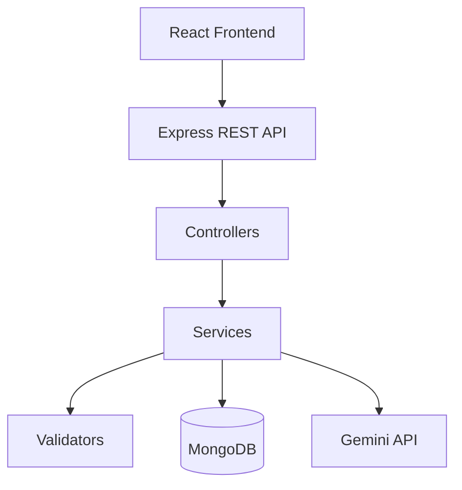

# AI Budget Tracker

## Overview

AI Budget Tracker is a full-stack personal budget application built for an internship evaluation. Users define Budget Rules, describe money movements in natural language, and review AI-parsed results before saving. The backend validates input, calls Gemini for interpretation, persists transactions in MongoDB, allocates income server-side, and powers Dashboard and History views.

**Core workflow**

Budget Rules → natural-language transaction → Gemini parsing → backend validation → user review/confirmation → MongoDB persistence → income allocation snapshots → Dashboard / History updates

## Key Features

- Configurable Budget Rules with percentages that must total exactly 100%
- Gemini-powered natural-language transaction parsing (backend only)
- Structured AI output validation (amount, direction, category, date)
- Transaction review and confirmation UI before persistence
- Server-side transaction validation before MongoDB writes
- Automatic income allocation with immutable allocation snapshots
- Current-month Dashboard (summary metrics + per-category cards)
- Budget status badges (`healthy` / `warning` / `over`)
- Transaction History (newest first)
- Live Dashboard and History refetch after successful confirmation (no browser refresh)
- Responsive, accessible UI with shared design tokens
- Professional branding (SVG brand mark / favicon) and static SEO metadata

## Technology Stack

| Layer | Technologies |
| --- | --- |
| **Frontend** | React 19, Vite 8, CSS (no UI framework) |
| **Backend** | Node.js (ES modules), Express 5, Zod, CORS |
| **Database** | MongoDB via Mongoose |
| **AI** | Google Gemini (`@google/genai`) |
| **Development** | npm workspaces-style root scripts, Vite `/api` proxy, Oxlint |

## Architecture



- The React client never calls Gemini directly.
- Gemini is used only by the backend to interpret transaction text.
- The backend is the source of truth for validation, Budget Rules, allocation, and persistence.
- Allocation amounts are calculated server-side and are never trusted from the client.

## Application Flow

1. User configures Budget Rules (categories + percentages totaling 100%).
2. User enters a natural-language transaction on the Transactions screen.
3. Frontend calls `POST /api/ai/parse-transaction`.
4. Backend loads current Budget Rules and calls Gemini.
5. Backend validates structured output (Zod).
6. Frontend shows a review/confirmation card (category can be adjusted for expenses).
7. User confirms.
8. Frontend calls `POST /api/transactions`; backend validates again.
9. For income, backend calculates allocations from current Budget Rules.
10. MongoDB persists the transaction (with allocation snapshot for income).
11. App increments a client-side transaction revision; Dashboard and History refetch without a browser refresh.

## Budget Rules

- Categories are user-configurable (names and percentages).
- At least one category is required; names must be unique (case-insensitive).
- Percentages must total **exactly 100%** (cent-based comparison).
- Income allocation uses the **current** Budget Rules at confirmation time.
- Historical income documents store allocation snapshots; changing Budget Rules later does **not** rewrite past snapshots.
- Dashboard category cards always reflect the **current** Budget Rules list; allocated amounts for each category come from matching snapshot categories on current-month income.

Endpoints:

- `GET /api/budget-rules`
- `PUT /api/budget-rules`

## AI Transaction Parsing

```
POST /api/ai/parse-transaction
Content-Type: application/json
```

Request body:

```json
{
  "text": "Spent 4,000 on groceries"
}
```

Behavior:

- Accepts natural-language text (max 500 characters).
- Backend calls Gemini and returns structured fields: `amount`, `direction`, `category`, `date`.
- Validates structured output; does **not** persist the transaction.
- Expense categories must match configured Budget Rules when confidently known.
- Ambiguous expense categories may be `null` and require user selection before save.
- Income uses category `"Income"`.
- Dates use `YYYY-MM-DD`; missing/relative dates resolve against the application calendar date (local “today”).

## Transaction Persistence

```
POST /api/transactions
Content-Type: application/json
```

Persisted fields include: `originalSentence`, `amount`, `direction`, `category`, `date`, `allocations`, timestamps.

Rules:

- The original sentence is stored exactly as confirmed.
- The create schema accepts only `originalSentence`, `amount`, `direction`, `category`, and `date` — clients cannot submit allocation data.
- Income allocations are calculated by the backend from current Budget Rules and stored as a snapshot.
- Expenses store `"allocations": []`.
- Validation runs before MongoDB persistence.

Income example:

```json
{
  "originalSentence": "Received 50,000 from web client",
  "amount": 50000,
  "direction": "income",
  "category": "Income",
  "date": "2026-08-09"
}
```

Example income response (allocations illustrative of a 40/30/20/10 rule set):

```json
{
  "success": true,
  "data": {
    "transaction": {
      "id": "...",
      "originalSentence": "Received 50,000 from web client",
      "amount": 50000,
      "direction": "income",
      "category": "Income",
      "date": "2026-08-09",
      "allocations": [
        { "category": "Needs", "percentage": 40, "amount": 20000 },
        { "category": "Wants", "percentage": 30, "amount": 15000 },
        { "category": "Savings", "percentage": 20, "amount": 10000 },
        { "category": "Investment", "percentage": 10, "amount": 5000 }
      ]
    }
  }
}
```

Expense example:

```json
{
  "originalSentence": "Spent 4,000 on groceries",
  "amount": 4000,
  "direction": "expense",
  "category": "Needs",
  "date": "2026-08-09"
}
```

## Income Allocation

Allocation uses minor-unit (cent) math in `allocateIncome`:

1. Convert income to cents.
2. For each category except the last: `floor(totalCents × percentage / 100)`.
3. The last category receives the remaining cents so the sum **exactly** matches the income.

Example for Rs. 50,000 with 40% / 30% / 20% / 10%:

| Category | Percentage | Amount |
| --- | ---: | ---: |
| Needs | 40% | Rs. 20,000 |
| Wants | 30% | Rs. 15,000 |
| Savings | 20% | Rs. 10,000 |
| Investment | 10% | Rs. 5,000 |
| **Total** | **100%** | **Rs. 50,000** |

## Dashboard

```
GET /api/dashboard
```

Returns the **current-month** summary (application local calendar month).

**Summary metrics** (`data.summary`):

| Field | Meaning |
| --- | --- |
| `totalIncome` | Sum of current-month income transaction amounts |
| `totalSpent` | Sum of current-month expense transaction amounts |
| `available` | `totalIncome - totalSpent` |

**Per-category metrics** (one entry per current Budget Rules category):

| Field | Meaning |
| --- | --- |
| `allocated` | Sum of matching income allocation snapshot amounts this month |
| `used` | Sum of expense amounts in that category this month |
| `remaining` | `allocated - used` (may be negative) |
| `usagePercentage` | Used ÷ allocated × 100 (may exceed 100; `null` when allocated is 0 and used &gt; 0) |
| `status` | `healthy` / `warning` / `over` |

**Status thresholds** (backend):

| Status | Condition |
| --- | --- |
| `healthy` | usage &lt; 70% (or allocated = 0 and used = 0) |
| `warning` | usage 70–100% inclusive |
| `over` | usage &gt; 100%, or allocated = 0 with used &gt; 0 |

Previous-month and future-dated transactions do not contribute to the current-month dashboard.

UI: compact Total Income / Total Spent / Available row, then dynamic category cards with status badges (Healthy / Watch / Over budget). Progress bar width is capped at 100% while the usage label can show values above 100%.

## Transaction History

```
GET /api/transactions
```

Read-only list of saved transactions, newest first (`createdAt` descending, with `_id` tie-break).

History UI fields: original sentence, amount, direction, category, date.

Filtering and search are **not** implemented.

Empty history returns HTTP 200 with `transactions: []`.

## Live Updates

After a successful `POST /api/transactions`:

1. Transactions UI shows the saved state.
2. App increments a client-side `transactionRevision`.
3. Dashboard and History treat data as stale and refetch `GET /api/dashboard` and `GET /api/transactions`.

Failed saves do not increment the revision. This is client-side invalidation/refetch — not WebSockets or server push.

## API Reference

| Method | Endpoint | Purpose |
| --- | --- | --- |
| `GET` | `/api/health` | Health check |
| `GET` | `/api/budget-rules` | Load Budget Rules |
| `PUT` | `/api/budget-rules` | Replace Budget Rules |
| `POST` | `/api/ai/parse-transaction` | Parse natural-language text via Gemini (no persistence) |
| `GET` | `/api/transactions` | List transactions (newest first) |
| `POST` | `/api/transactions` | Persist a confirmed transaction |
| `GET` | `/api/dashboard` | Current-month dashboard summary |

## Project Structure

```
ai-budget-tracker/
├── client/                 # React + Vite frontend
│   ├── public/             # favicon.svg, brand-mark.svg
│   ├── src/
│   │   ├── api/            # fetch helpers (/api proxy)
│   │   ├── components/
│   │   │   ├── budgetRules/
│   │   │   ├── dashboard/
│   │   │   ├── history/
│   │   │   ├── layout/
│   │   │   └── transactions/
│   │   ├── utils/
│   │   ├── App.jsx
│   │   └── main.jsx
│   └── package.json
├── server/                 # Express API (ES modules)
│   ├── .env.example
│   ├── src/
│   │   ├── config/         # env, db, gemini
│   │   ├── controllers/
│   │   ├── middleware/
│   │   ├── models/
│   │   ├── routes/
│   │   ├── services/
│   │   ├── utils/          # allocation, metrics, dates, errors
│   │   ├── validators/
│   │   ├── app.js
│   │   └── index.js
│   └── package.json
├── .gitignore
├── package.json            # install:all, dev:client, dev:server
└── README.md
```

## Setup

### Requirements

- Node.js 18 or newer
- npm
- MongoDB (e.g. Atlas) and a Gemini API key

### Install dependencies

From the repository root:

```bash
npm run install:all
```

Or separately:

```bash
npm install --prefix client
npm install --prefix server
```

### Environment configuration

```bash
cp server/.env.example server/.env
```

PowerShell:

```powershell
Copy-Item server/.env.example server/.env
```

Configure `server/.env` (never commit this file):

| Variable | Required | Notes |
| --- | --- | --- |
| `PORT` | No | Defaults to `5000` |
| `MONGODB_URI` | Yes | MongoDB connection string |
| `GEMINI_API_KEY` | Yes | Google AI API key |
| `GEMINI_MODEL` | No | Defaults to `gemini-3.6-flash` |

### Run the backend

```bash
npm run dev:server
```

Production-style start:

```bash
npm run start --prefix server
```

### Run the frontend

```bash
npm run dev:client
```

Vite proxies `/api` to `http://localhost:5000`. Keep the backend running during frontend development.

### Health check

```
GET http://localhost:5000/api/health
```

## Testing / Verification

This repository does not include an automated test suite. Verification is performed manually against the running API and UI, including:

- Gemini parsing (`POST /api/ai/parse-transaction`)
- Transaction persistence and duplicate-click protection on Confirm
- Income allocation totals matching income amounts
- Zod/API validation errors for invalid rules or transactions
- Dashboard month filtering and summary/category calculations
- History newest-first ordering and original-sentence display
- Live refetch after successful confirmation (no browser refresh)
- Frontend production build: `npm run build --prefix client`

## Security / Trust Boundaries

- Secrets (`MONGODB_URI`, `GEMINI_API_KEY`) live only in `server/.env` (gitignored).
- The frontend does not access MongoDB or Gemini directly.
- All Gemini calls and allocation math run on the server.
- Client input is validated with Zod before persistence.
- Error responses return `{ success: false, message }` without credentials; production 5xx responses use a generic message.

## Current Scope

### Implemented

- Budget Rules UI and API
- Gemini parse → review → confirm → persist
- Income allocation snapshots
- Dashboard API and UI (summary + categories)
- Transaction History API and UI
- Client-side Dashboard/History invalidation after save
- Branding favicon/logo and static SEO metadata

### Not Included

- Authentication / multi-user accounts
- History filtering or search
- Transaction edit/delete APIs
- Automated test suite
- Deployed production URL / SSR

## Project Status

The core internship evaluation workflow is implemented end to end:

```text
Budget Rules → Parse → Confirm → Persist → Dashboard & History (live refetch)
```

## Improvements With More Time

If additional development time were available, the next improvements would be:

- Authentication and multi-user support
- Transaction filtering and search
- Transaction edit/delete workflows
- Automated frontend and backend test suites
- Production deployment with environment-specific configuration
- More advanced spending analytics and historical trends
